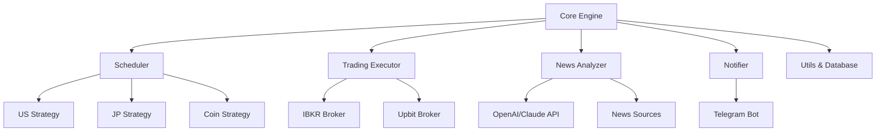

# 🏆 최고퀸트프로젝트 - 글로벌 퀀트 트레이딩 시스템

[](https://www.python.org/)
[](LICENSE)
[](README.md)
[](test_strategies.py)

> 🌍 **전 세계 시장을 아우르는 완전체 퀀트 트레이딩 시스템**  
> AI 뉴스 분석, 듀얼 브로커 연동, 스마트 스케줄링을 통한 자동화된 글로벌 투자

## 📋 목차

- [✨ 주요 특징](#-주요-특징)
- [🏗️ 시스템 아키텍처](#️-시스템-아키텍처)
- [📊 지원 시장 및 전략](#-지원-시장-및-전략)
- [🚀 빠른 시작](#-빠른-시작)
- [⚙️ 설정 가이드](#️-설정-가이드)
- [📁 프로젝트 구조](#-프로젝트-구조)
- [💰 브로커 연동](#-브로커-연동)
- [📱 알림 설정](#-알림-설정)
- [🧪 테스트](#-테스트)
- [📈 사용 예제](#-사용-예제)
- [🔧 문제 해결](#-문제-해결)
- [🤝 기여하기](#-기여하기)
- [📄 라이센스](#-라이센스)

## ✨ 주요 특징

### 🌍 **글로벌 시장 통합 지원**
- 🇺🇸 **미국 주식**: S&P 500, NASDAQ 종목 (버핏 + 린치 전략)
- 🇯🇵 **일본 주식**: 닛케이 225, 토픽스 종목 (일목균형표 + 모멘텀)
- 🪙 **암호화폐**: 업비트 전 종목 (거래량 급증 + 공포탐욕지수)

### 🤖 **AI 기반 뉴스 분석**
- **OpenAI GPT-4** 또는 **Anthropic Claude** 센티먼트 분석
- 실시간 다중 뉴스 소스 수집 (Yahoo Finance, Google News, Reuters)
- 시장별 뉴스 가중치 자동 조정

### 💰 **듀얼 브로커 통합**
- **Interactive Brokers (IBKR)**: 미국/일본 주식 자동 매매
- **업비트 (Upbit)**: 암호화폐 자동 매매
- 신뢰도 기반 포지션 사이징 및 리스크 관리

### 📅 **스마트 스케줄링**
```
월요일: 🪙 암호화폐 전략
화요일: 🇺🇸 미국 + 🇯🇵 일본 주식
수요일: 😴 휴무
목요일: 🇺🇸 미국 + 🇯🇵 일본 주식  
금요일: 🪙 암호화폐 전략
주말: 😴 휴무
```

### 🔔 **실시간 알림 시스템**
- 텔레그램 봇을 통한 즉시 알림
- 매매 신호, 실행 완료, 일일 성과 리포트
- 뉴스 이벤트 및 시스템 상태 알림

## 🏗️ 시스템 아키텍처



## 📊 지원 시장 및 전략

### 🇺🇸 미국 주식 전략
- **기술적 분석**: RSI, MACD, 볼린저 밴드
- **가치 투자**: 버핏 스타일 재무비율 분석  
- **성장 투자**: 피터 린치 스타일 성장률 분석
- **뉴스 가중치**: 30%

### 🇯🇵 일본 주식 전략  
- **일목균형표**: 구름대, 전환선, 기준선 분석
- **모멘텀**: 가격 모멘텀 및 거래량 분석
- **시장 센티먼트**: 닛케이 VIX 연동
- **뉴스 가중치**: 40%

### 🪙 암호화폐 전략
- **거래량 급증**: 평균 대비 거래량 급증 탐지
- **공포탐욕지수**: Crypto Fear & Greed Index 활용
- **기술적 분석**: 암호화폐 특화 지표
- **뉴스 가중치**: 50% (높은 뉴스 민감도)

## 🚀 빠른 시작

### 1. 설치

```bash
# 저장소 클론
git clone https://github.com/your-username/quant-trading-system.git
cd quant-trading-system

# 가상환경 생성 (권장)
python -m venv venv
source venv/bin/activate  # Windows: venv\Scripts\activate

# 의존성 설치
pip install -r requirements.txt
```

### 2. 기본 설정

```bash
# 설정 파일 복사
cp configs/settings.yaml.example configs/settings.yaml

# 환경변수 설정
cp .env.example .env
```

### 3. 테스트 실행

```bash
# 빠른 테스트
python test_strategies.py --quick

# 전체 테스트
python test_strategies.py
```

### 4. 시스템 실행

```bash
# 메인 시스템 실행
python core.py

# 개별 모듈 테스트
python scheduler.py     # 스케줄링 테스트
python news_analyzer.py # 뉴스 분석 테스트
python trading.py       # 매매 시스템 테스트
```

## ⚙️ 설정 가이드

### 📝 configs/settings.yaml

```yaml
# API 설정
api:
  openai_api_key: "sk-your-openai-key"
  ibkr:
    enabled: true
    paper_trading: true  # 모의거래 모드
    tws_port: 7497
  upbit:
    enabled: true
    access_key: "your-upbit-access-key"
    secret_key: "your-upbit-secret-key"

# 알림 설정
notifications:
  telegram:
    enabled: true
    bot_token: "your-telegram-bot-token"
    chat_id: "your-telegram-chat-id"

# 거래 설정
trading:
  paper_trading: true      # 실거래: false
  auto_execution: true     # 자동 실행
  max_daily_trades: 20     # 일일 최대 거래 수
```

### 🔐 환경변수 (.env)

```bash
# API 키 (보안)
OPENAI_API_KEY=sk-your-openai-key
ANTHROPIC_API_KEY=your-anthropic-key
TELEGRAM_BOT_TOKEN=your-telegram-bot-token
TELEGRAM_CHAT_ID=your-telegram-chat-id

# 업비트 API
UPBIT_ACCESS_KEY=your-upbit-access-key
UPBIT_SECRET_KEY=your-upbit-secret-key

# IBKR 설정
IBKR_TWS_PORT=7497
IBKR_CLIENT_ID=1
```

## 📁 프로젝트 구조

```
📁 최고퀸트프로젝트/
├── 📁 configs/                     # 설정 파일
│   ├── settings.yaml               # 메인 설정
│   └── settings.yaml.example       # 설정 예제
├── 📁 strategies/                  # 투자 전략
│   ├── us_strategy.py              # 미국 주식 전략
│   ├── jp_strategy.py              # 일본 주식 전략
│   └── coin_strategy.py            # 암호화폐 전략
├── 📁 tests/                       # 테스트
│   └── test_strategies.py          # 통합 테스트 시스템
├── 📁 data/                        # 데이터 저장 (자동 생성)
│   ├── trades/                     # 거래 기록
│   ├── analysis/                   # 분석 결과
│   └── logs/                       # 로그 파일
├── 📁 reports/                     # 성과 리포트 (자동 생성)
├── core.py                         # 🔥 메인 실행 엔진
├── scheduler.py                    # 📅 스케줄링 시스템
├── trading.py                      # 💰 매매 실행 시스템
├── news_analyzer.py                # 📰 뉴스 분석 시스템
├── notifier.py                     # 🔔 알림 시스템
├── utils.py                        # 🛠️ 유틸리티 함수
├── requirements.txt                # 📦 의존성 패키지
├── README.md                       # 📚 프로젝트 문서
├── .env.example                    # 환경변수 예제
└── .gitignore                      # Git 무시 파일
```

## 💰 브로커 연동

### 🏦 Interactive Brokers (IBKR) 설정

1. **TWS (Trader Workstation) 설치**
   ```bash
   # https://www.interactivebrokers.com/en/trading/tws.php
   # TWS 다운로드 및 설치
   ```

2. **API 설정 활성화**
   ```
   TWS → 설정 → API 설정
   ✅ Enable ActiveX and Socket Clients 체크
   ✅ Read-Only API 해제 (실거래시)
   포트: 7497 (모의거래) / 7496 (실거래)
   ```

3. **테스트 연결**
   ```bash
   python -c "
   from ib_insync import IB
   ib = IB()
   ib.connect('127.0.0.1', 7497, clientId=1)
   print('IBKR 연결 성공!')
   ib.disconnect()
   "
   ```

### 🪙 업비트 (Upbit) 설정

1. **API 키 발급**
   ```
   업비트 웹사이트 → 마이페이지 → Open API 관리
   ✅ 자산 조회 권한
   ✅ 주문 조회 권한  
   ✅ 주문하기 권한 (실거래시만)
   ```

2. **권한 설정**
   ```
   ⚠️ 초기에는 "주문하기" 권한 없이 테스트 권장
   📊 자산 조회, 주문 조회만으로 모의거래 가능
   ```

3. **테스트 연결**
   ```bash
   python -c "
   import sys
   sys.path.append('.')
   from trading import UpbitBroker
   broker = UpbitBroker()
   print('업비트 연결 성공!')
   "
   ```

## 📱 알림 설정

### 🤖 텔레그램 봇 생성

1. **BotFather와 대화**
   ```
   텔레그램에서 @BotFather 검색 → 대화 시작
   /newbot → 봇 이름 입력 → 봇 토큰 획득
   ```

2. **Chat ID 확인**
   ```bash
   # 봇과 대화 후 다음 URL 방문
   https://api.telegram.org/bot<YOUR_BOT_TOKEN>/getUpdates
   
   # "chat":{"id": 숫자} 부분이 Chat ID
   ```

3. **알림 테스트**
   ```bash
   python -c "
   import asyncio
   from notifier import send_telegram_message
   asyncio.run(send_telegram_message('🤖 최고퀸트프로젝트 연결 테스트'))
   "
   ```

## 🧪 테스트

### 전체 시스템 테스트

```bash
# 기본 테스트 (빠름)
python test_strategies.py --quick

# 완전한 테스트 (상세)
python test_strategies.py

# 상세 로그와 함께
python test_strategies.py --verbose
```

### 개별 모듈 테스트

```bash
# 전략 테스트
python strategies/us_strategy.py
python strategies/jp_strategy.py  
python strategies/coin_strategy.py

# 시스템 테스트
python scheduler.py      # 스케줄링
python news_analyzer.py  # 뉴스 분석
python trading.py        # 매매 시스템
python notifier.py       # 알림 시스템
```

### 테스트 결과 예시

```bash
🧪 최고퀸트프로젝트 완전체 테스트 시스템
==================================================
🚀 테스트 모드: 전체 테스트
⏰ 시작 시간: 2025-06-23 15:30:45

1️⃣ 모듈 Import 테스트
   ✅ 성공 (0.02s)
   ✅ 성공 (0.01s)
   ...

📋 테스트 결과 요약
==================================================
📊 전체 테스트: 45개
✅ 성공: 42개  
❌ 실패: 3개
📈 성공률: 93.3%

🏆 최종 판정:
   🎉 EXCELLENT - 최고퀸트프로젝트가 완벽하게 작동합니다!
```

## 📈 사용 예제

### 기본 실행

```python
# core.py - 메인 시스템 실행
from core import QuantTradingEngine
import asyncio

async def main():
    # 엔진 초기화
    engine = QuantTradingEngine()
    
    # 분석 실행
    summary = await engine.run_analysis()
    print(f"분석 완료: {summary.total_analyzed}개 종목")
    
    # 자동 매매 (설정에 따라)
    if engine.auto_execution:
        executed = await engine.execute_signals()
        print(f"실행 완료: {len(executed)}개 거래")

if __name__ == "__main__":
    asyncio.run(main())
```

### 개별 전략 사용

```python
# 미국 주식 분석
from strategies.us_strategy import analyze_us

result = await analyze_us('AAPL')
print(f"AAPL 분석: {result['decision']} ({result['confidence_score']:.0f}%)")

# 암호화폐 분석  
from strategies.coin_strategy import analyze_coin

result = await analyze_coin('BTC-KRW')
print(f"BTC 분석: {result['decision']} ({result['confidence_score']:.0f}%)")
```

### 뉴스 분석

```python
# 뉴스 센티먼트 분석
from news_analyzer import get_news_sentiment

sentiment, reasoning = await get_news_sentiment('AAPL', 'US')
print(f"AAPL 뉴스 센티먼트: {sentiment:.2f} ({reasoning})")
```

### 스케줄링 확인

```python
# 오늘 활성 전략 확인
from scheduler import get_today_strategies, get_schedule_status

strategies = get_today_strategies()
print(f"오늘 활성 전략: {strategies}")

status = get_schedule_status()
print(f"스케줄러 상태: {status}")
```

## 🔧 문제 해결

### 자주 발생하는 문제

#### 1. 모듈 Import 오류
```bash
ModuleNotFoundError: No module named 'xyz'

# 해결방법:
pip install -r requirements.txt
```

#### 2. IBKR 연결 실패  
```bash
ConnectionRefusedError: [Errno 61] Connection refused

# 해결방법:
1. TWS가 실행 중인지 확인
2. API 설정이 활성화되어 있는지 확인  
3. 포트 번호 확인 (7497: 모의거래, 7496: 실거래)
```

#### 3. 업비트 API 오류
```bash
401 Unauthorized

# 해결방법:
1. API 키가 올바른지 확인
2. IP 액세스 제한 확인
3. 권한 설정 확인 (자산조회, 주문조회)
```

#### 4. 텔레그램 알림 실패
```bash
Telegram API error

# 해결방법:
1. 봇 토큰이 올바른지 확인
2. Chat ID가 올바른지 확인  
3. 봇과 대화를 시작했는지 확인
```

### 로그 확인

```bash
# 로그 파일 위치
📁 data/logs/
├── trading_YYYYMMDD.log      # 거래 로그
├── analysis_YYYYMMDD.log     # 분석 로그
├── error_YYYYMMDD.log        # 에러 로그
└── system_YYYYMMDD.log       # 시스템 로그
```

### 디버그 모드

```bash
# 상세 로그와 함께 실행
python core.py --debug

# 개별 모듈 디버그
python -c "
import logging
logging.basicConfig(level=logging.DEBUG)
# 원하는 코드 실행
"
```

## 🛡️ 보안 및 리스크 관리

### 🔐 API 키 보안
- ✅ 환경변수 사용 (.env 파일)
- ✅ .gitignore에 민감 정보 추가
- ✅ 프로덕션에서는 별도 키 관리 시스템 사용

### 💰 리스크 관리 기능
- **포지션 사이징**: 신뢰도 기반 자동 조절
- **일일 거래 한도**: 설정 가능한 최대 거래 수
- **신뢰도 필터링**: 최소 신뢰도 이하 신호 차단
- **모의거래 모드**: 실거래 전 충분한 테스트

### ⚠️ 주의사항
1. **처음에는 모의거래로 시작** (`paper_trading: true`)
2. **소액으로 실거래 테스트** 후 규모 확대
3. **시장 급변 시 자동매매 일시 중단** 고려
4. **정기적인 성과 검토** 및 전략 조정

## 📊 성과 모니터링

### 일일 리포트
- 📈 거래 성과 요약
- 📊 시장별 분석 결과  
- 💰 수익률 및 위험 지표
- 📰 주요 뉴스 이벤트

### 데이터 백업
```bash
# 자동 백업 설정 (cron)
0 2 * * * cd /path/to/project && python -c "
from utils import FileManager
FileManager.backup_data()
"
```

## 🤝 기여하기

### 개발 환경 설정

```bash
# 개발용 의존성 설치
pip install -r requirements.txt
pip install pytest black flake8 mypy

# 코드 품질 검사
black .                    # 코드 포맷팅
flake8 .                  # 린팅
mypy .                    # 타입 체킹
pytest tests/             # 테스트 실행
```

### 기여 가이드라인

1. **이슈 생성**: 버그 리포트 또는 기능 요청
2. **포크 및 브랜치**: feature/your-feature-name
3. **코드 작성**: PEP 8 스타일 가이드 준수
4. **테스트 추가**: 새로운 기능에 대한 테스트 작성
5. **풀 리퀘스트**: 상세한 설명과 함께 PR 생성

### 개발 로드맵

- [ ] **웹 인터페이스**: FastAPI 기반 대시보드
- [ ] **추가 브로커**: 키움증권, 바이낸스 연동
- [ ] **고급 전략**: 머신러닝 기반 예측 모델
- [ ] **백테스팅**: 과거 데이터 기반 전략 검증
- [ ] **포트폴리오 최적화**: 마코위츠 최적화 적용

## 📄 라이센스

이 프로젝트는 MIT 라이센스를 따릅니다. 자세한 내용은 [LICENSE](LICENSE) 파일을 참조하세요.

```
MIT License

Copyright (c) 2025 최고퀸트팀

Permission is hereby granted, free of charge, to any person obtaining a copy
of this software and associated documentation files (the "Software"), to deal
in the Software without restriction, including without limitation the rights
to use, copy, modify, merge, publish, distribute, sublicense, and/or sell
copies of the Software, and to permit persons to whom the Software is
furnished to do so, subject to the following conditions:

The above copyright notice and this permission notice shall be included in all
copies or substantial portions of the Software.

THE SOFTWARE IS PROVIDED "AS IS", WITHOUT WARRANTY OF ANY KIND, EXPRESS OR
IMPLIED, INCLUDING BUT NOT LIMITED TO THE WARRANTIES OF MERCHANTABILITY,
FITNESS FOR A PARTICULAR PURPOSE AND NONINFRINGEMENT. IN NO EVENT SHALL THE
AUTHORS OR COPYRIGHT HOLDERS BE LIABLE FOR ANY CLAIM, DAMAGES OR OTHER
LIABILITY, WHETHER IN AN ACTION OF CONTRACT, TORT OR OTHERWISE, ARISING FROM,
OUT OF OR IN CONNECTION WITH THE SOFTWARE OR THE USE OR OTHER DEALINGS IN THE
SOFTWARE.
```

## 🙏 감사의 말

이 프로젝트는 다음 오픈소스 라이브러리들의 도움으로 완성되었습니다:

- **ib-insync**: Interactive Brokers API 연동
- **yfinance**: 야후 파이낸스 데이터
- **python-telegram-bot**: 텔레그램 봇 API
- **pandas & numpy**: 데이터 처리 및 분석
- **OpenAI & Anthropic**: AI 기반 뉴스 분석

## 📞 지원 및 문의

- **이슈 트래커**: [GitHub Issues](https://github.com/your-username/quant-trading-system/issues)
- **문서**: [GitHub Wiki](https://github.com/your-username/quant-trading-system/wiki)
- **이메일**: your-email@example.com

---

<div align="center">

**🏆 최고퀸트프로젝트 - 전 세계 시장을 정복하세요! 🌍**

[](https://github.com/your-username/quant-trading-system)
[](https://github.com/your-username/quant-trading-system)

Made with ❤️ by 최고퀸트팀

</div>